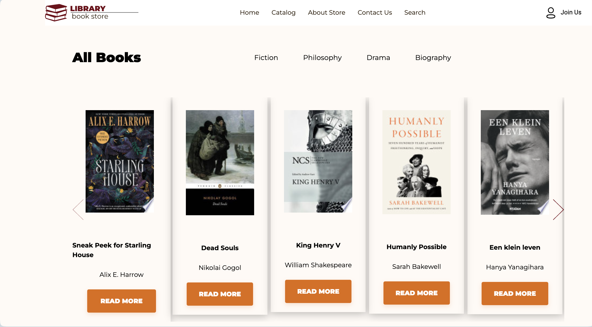
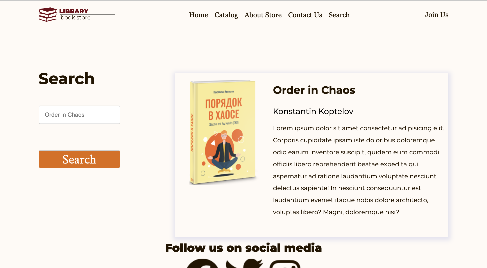

# Online Book Store Project

An online bookstore software projects that acts as a central database containing various books in stock along with their title, description and author. A user will be able to visit the website can see a wide range of books arranged in respective categories. The user may select desired book and view its details. The user also can contact us or join us via filling in a form and the user details will be send to our database. Functionalities include admin login, admin logout, adding, updating books, join us, searching and written in html, css, js, bootstrap, RST-API , GOOGLE FIREBASE real-time database using Visual Studio. 
Functionalities include admin login, admin logout, adding and updating books, join us, searching.
- P.S. : File downloading (book image), and identity authentication and shopping cart will be added
  
## Screenshots 
HOME PAGE

POP-UP COMPONENT

CATALOGE PAGE

SEARCH PAGE

## Contributors as in pair programming groups
- Aysel & Gachay

## Project repositories
- CLIENT SIDE GIT REPO : https://github.com/codewithgachay/book-store-project.git
## Running the project
- CLIENT SIDE GIT PAGE : https://codewithgachay.github.io/book-store-project/index.html
- ADMIN SIDE GIT PAGE:https://codewithgachay.github.io/admin/
